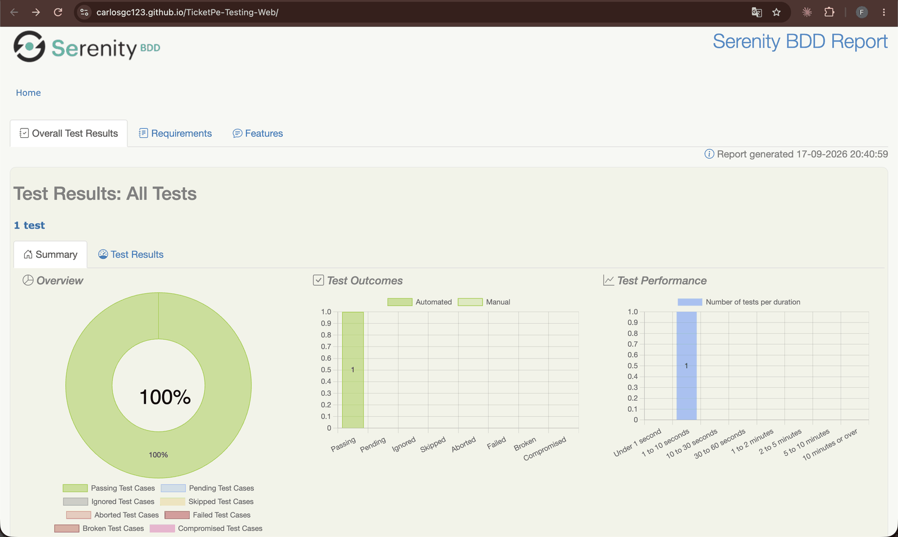
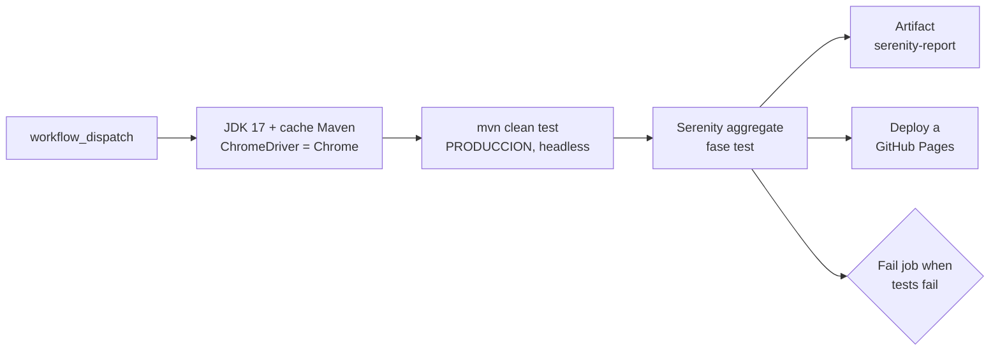
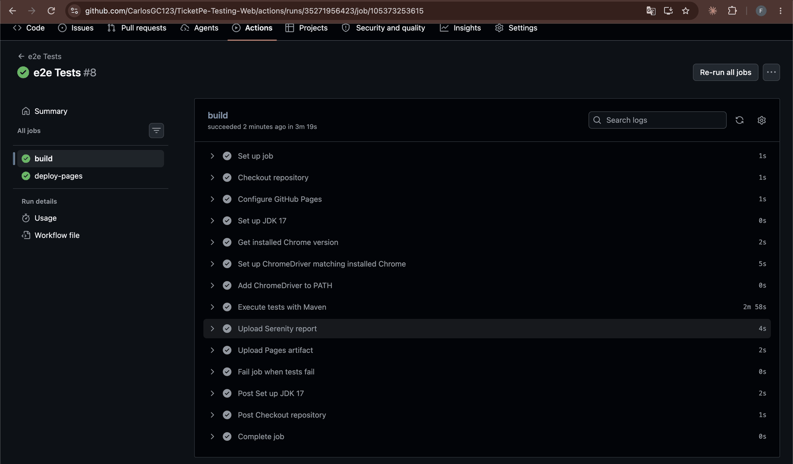
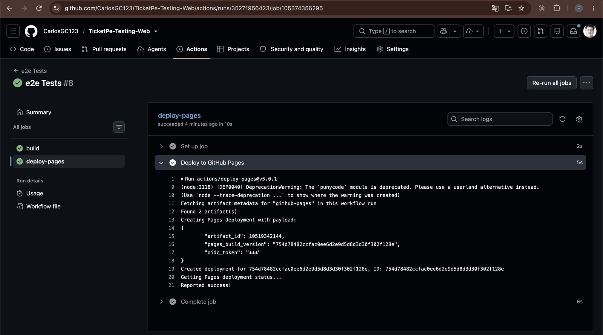
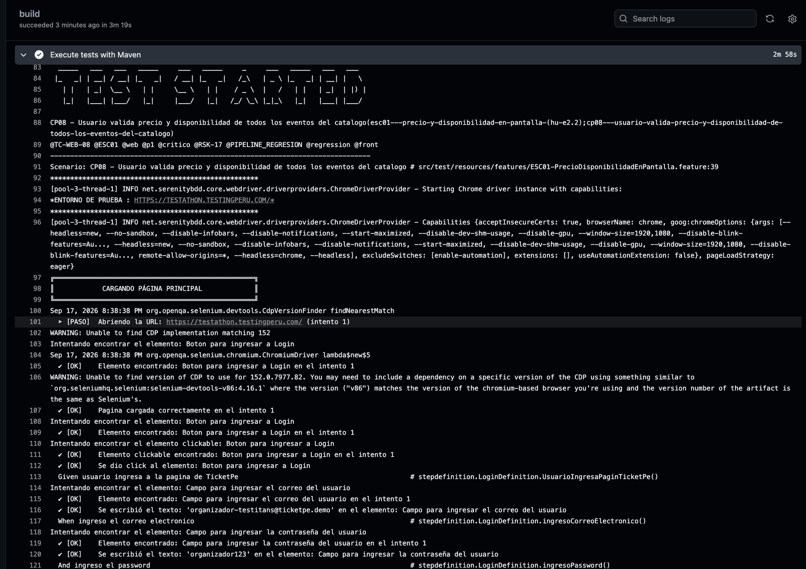

# TicketPe-Testing-Web

[](https://github.com/CarlosGC123/TicketPe-Testing-Web/actions/workflows/e2e.yml)
[](https://carlosgc123.github.io/TicketPe-Testing-Web/)

**Suite E2E web de TicketPe** con el patrón **Screenplay**: login, catálogo, checkout, mis entradas
y chat sobre el navegador real, con reporte Serenity publicado en GitHub Pages en cada corrida.
Serenity BDD 4.0.30 · Cucumber · Selenium 4.15 · REST Assured · Java 17 · Maven · GitHub Actions.

Equipo **TesTitans** · Testathon 2026.

| | |
|---|---|
| 📊 **Reporte en vivo** (última corrida) | https://carlosgc123.github.io/TicketPe-Testing-Web/ |
| 🌐 **SUT** | https://testathon.testingperu.com/ |
| 🔌 **API de contraste** | `https://testathon.testingperu.com/api/core` (oráculo front vs back) |
| ⚙️ **Pipeline** | [`.github/workflows/e2e.yml`](.github/workflows/e2e.yml): manual (`workflow_dispatch`) |
| 📦 **Evidencia descargable** | artifact `serenity-report` de cada run (30 días) |

## Resultado

El reporte Serenity queda publicado en Pages **aunque la suite falle**: cada corrida deja su
evidencia (pasos, capturas, tiempos) en una URL fija, sin descargar nada.



*Run #8 (17-09-2026, 20:40:59 UTC): el caso `@PIPELINE_REGRESION` **CP08** pasó — 1 test, 100%,
duración entre 1 y 10 s. En el run #7 el job `build` quedó en rojo y `deploy-pages` igual publicó
el reporte.*

## Qué cubre

Runner activo: [`CucumberTestSuite`](src/test/java/runner/CucumberTestSuite.java) con
`tags = "@PIPELINE_REGRESION"` — de los 9 escenarios del repo, **CI ejecuta solo CP08**
(el candidato de continuous testing). El resto corre bajo demanda cambiando el tag.

| Feature | Caso | Tag ID | Prioridad | En CI |
|---|---|---|---|---|
| **ESC00 · Autenticación** (HU-E1.2) | CP01 · login con credenciales válidas | `@LOGIN` | p1 · crítico | — |
| **ESC01 · Precio y disponibilidad** (HU-E2.2) | CP01 · precio y cupo de la ficha vs tarjeta | `@TC-WEB-01` | p2 · alto | — |
| | CP02 · evento agotado no permite comprar | `@TC-WEB-02` | p2 · alto | — |
| | CP08 · valida **todo** el catálogo contra la API | `@TC-WEB-08` | p1 · crítico | ✅ |
| **ESC02 · Checkout** (HU-E3.3) | CP01 · pago rechazado y reintento sobre la misma reserva | `@TC-WEB-03` | p2 · alto | — |
| | CP02 · cuenta regresiva usa la hora del servidor | `@TC-WEB-04` | p2 · medio | — |
| **ESC03 · Mis entradas** (HU-E4.1) | CP01 · cada estado de entrada se refleja en pantalla | `@TC-WEB-05` | p2 · alto | — |
| **ESC04 · Chat web** (HU-E7.2) | CP01 · el chat pide confirmación antes de reservar | `@TC-WEB-06` | p1 · crítico | — |
| | CP02 · HTML en el chat se muestra literal (sin XSS) | `@TC-WEB-07` | p2 · crítico | — |

Tags transversales disponibles para filtrar: `@smoke`, `@regression`, `@security`, `@front`,
`@ESC0x`, `@RSK-xx` (riesgo trazado), `@p1`/`@p2`.

## Cómo trabaja el pipeline



**El reporte sale siempre y el job igual queda en rojo** si hay fallos: el estado del run no miente.



*Run #8: `build` en 3m 19s, con `Execute tests with Maven` ocupando 2m 58s del total.*

| Decisión | Por qué |
|---|---|
| `if: always()` en upload y deploy | un rojo también publica el reporte: la evidencia importa más cuando falla |
| `testFailureIgnore=true` en surefire + step `Fail job when tests fail` | Maven no corta antes del reporte; el job se marca rojo al final leyendo `surefire-reports` |
| `serenity-maven-plugin:aggregate` en la fase `test` | `mvn clean test` ya deja el HTML; no hace falta `verify` en CI |
| Doble salida: Pages + artifact | Pages muestra la última corrida; el artifact guarda el histórico por run |
| `concurrency: pages` sin cancelar | dos corridas seguidas no pisan el deploy a medias |
| Credenciales por `vars` en Base64 | nunca en el repo; se decodifican en runtime (`ObtenerCredenciales`) |
| ChromeDriver igual a la versión de Chrome del runner | `setup-chrome` evita el mismatch driver/navegador al actualizarse la imagen |
| Chrome headless en `serenity.conf` | corre igual en `ubuntu-latest` y en local |



*`deploy-pages` corre con `needs: build` + `if: always()`, así que publica pase lo que pase con los tests.*

## Ingeniería de la suite

- **Screenplay, no Page Objects gordos.** El actor ejecuta `Task`s (`DarClick`, `EscribeTexto`,
  `ValidarTodosLosEventosDelCatalogo`), hace `Question`s (`ElementoEsVisible`,
  `PrecioTarjetaCoincideConDetalle`) y los `page/` solo declaran `Target`s.
- **Oráculo front vs back.** `ClienteApiCore` consulta `/api/core` con REST Assured y las
  `Question`s comparan lo que muestra la pantalla contra la respuesta cruda en el mismo instante
  (riesgo `RSK-17`).
- **Robustez ante un ambiente lento.** `CargarPaginaPrincipal` reintenta y recarga si la página no
  responde; las `Question`s esperan visibilidad y clickeabilidad con reintentos antes de actuar.
- **Fallos legibles.** Cada acción falla con un `AssertionError` que nombra el elemento, no con un
  stacktrace de Selenium.
- **Consola con formato.** `FormatoConsola` imprime banner de inicio/fin, pasos, reintentos y una
  tabla con la duración total de la corrida.
- **Ambientes por configuración.** `-Denvironment` elige la `baseurl` de `serenity.conf`.



*Cada `[PASO]` y cada `✔ [OK]` sale de `FormatoConsola`, con el número de intento por elemento.*

## Ejecutar

Requisitos: **Java 17+**, **Maven 3.9+** y **Chrome**.

```sh
export CORREO=$(printf 'usuario@correo.com' | base64)
export PASSWORD=$(printf 'mi-password' | base64)
mvn clean test -Denvironment=PRODUCCION
```

Reporte: `target/site/serenity/index.html`. El tag a ejecutar se define en
`src/test/java/runner/CucumberTestSuite.java` (hoy `tags = "@PIPELINE_REGRESION"`); para correr
todo el set de regresión, cambiarlo a `@regression`.

<details>
<summary><b>Ambientes</b></summary>

Definidos en `src/test/resources/serenity.conf`:

| Ambiente | URL |
|---|---|
| `PRODUCCION` | `https://testathon.testingperu.com/` |
| `DESARROLLO` · `INTEGRACION` · `PREPRODUCCION` | placeholder, sin URL aún |

</details>

<details>
<summary><b>Configurar GitHub Pages</b></summary>

1. `Settings > Pages > Source`: **GitHub Actions**.
2. `Settings > Secrets and variables > Actions > Variables`: `CORREO` y `PASSWORD` en Base64.
3. `Actions > e2e Tests > Run workflow`.

</details>

<details>
<summary><b>Estructura</b></summary>

```
src/main/java/
  interaction/    CargarPaginaPrincipal (retry + recarga), IniciarSesionEnUI
  page/           Targets: Login, DashboardPage, CatalogoPage, EventoDetallePage,
                  CheckoutPage, MisEntradasPage, ChatPage, YoutubePage
  questions/      ElementoEsVisible/EsClickable + oráculos de negocio
                  (PrecioTarjetaCoincideConDetalle, XSSNoFueEjecutado,
                  TodosLosEventosTienenDatosConsistentes, ...)
  task/           EscribeTexto, clicks/DarClick, AbrirCatalogo, PagarConTarjeta,
                  ValidarTodosLosEventosDelCatalogo, tasks de setup por API
                  (CrearReservaPorAPI, ComprarEntradasPorAPI, ...)
  util/           ClienteApiCore, ObtenerCredenciales, DecodificadorBase64,
                  FormatoConsola, NavegadorReloj
src/test/java/
  runner/CucumberTestSuite.java   runner Serenity + banner y duración
  stepdefinition/                 Login, PrecioDisponibilidad, Checkout,
                                  MisEntradas, ChatWeb
src/test/resources/
  features/                       ESC01..ESC04 + Login.feature
  serenity.conf                   webdriver headless y ambientes
.github/workflows/e2e.yml         build, reporte y deploy a Pages
```

</details>

<details>
<summary><b>Otros documentos</b></summary>

| Archivo | Contenido |
|---|---|
| [`REGRESSION-SUITE.md`](REGRESSION-SUITE.md) | estrategia de regresión y continuous testing |
| [`REFACTORIZACION-GHERKIN.md`](REFACTORIZACION-GHERKIN.md) | criterios de redacción Gherkin aplicados |
| [`BACKUP-REPORTES.md`](BACKUP-REPORTES.md) | backup automático de reportes por corrida |
| [`CASOS-REGRESION-CATALOGO.md`](CASOS-REGRESION-CATALOGO.md) | casos candidatos sobre el catálogo |

</details>
