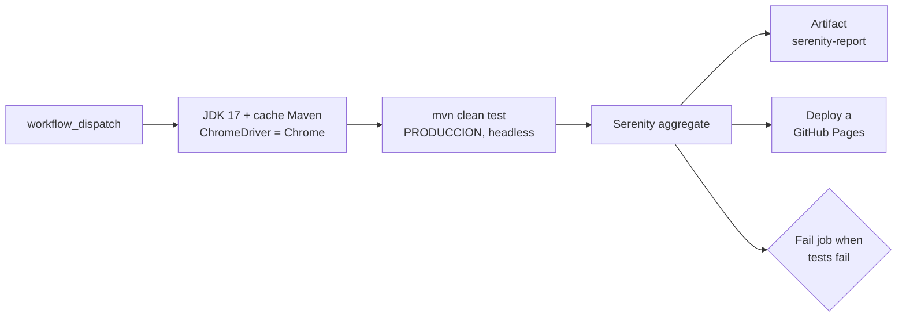

# TicketPe-Testing-Web

[](https://github.com/CarlosGC123/TicketPe-Testing-Web/actions/workflows/e2e.yml)
[](https://carlosgc123.github.io/TicketPe-Testing-Web/)

**Suite E2E web de TicketPe** con el patrón **Screenplay**: login y flujos de compra sobre el
navegador real, con reporte Serenity publicado en GitHub Pages en cada corrida.
Serenity BDD 3.3.0 · Cucumber · Selenium · Java 17 · Maven · GitHub Actions.

Equipo **TesTitans** · Testathon 2026.

| | |
|---|---|
| 📊 **Reporte en vivo** (última corrida) | https://carlosgc123.github.io/TicketPe-Testing-Web/ |
| 🌐 **SUT** | https://testathon.testingperu.com/ |
| ⚙️ **Pipeline** | [`.github/workflows/e2e.yml`](.github/workflows/e2e.yml): manual (`workflow_dispatch`) |
| 📦 **Evidencia descargable** | artifact `serenity-report` de cada run (30 días) |

## Resultado

El reporte Serenity queda publicado en Pages **aunque la suite falle**: cada corrida deja su
evidencia (pasos, capturas, tiempos) en una URL fija, sin descargar nada.


*Run #6 (2026-09-17): el escenario `@LOGIN` falló y el reporte igual quedó publicado en Pages.*

## Qué cubre

| Flujo | Qué se prueba | Tag | Estado |
|---|---|---|---|
| **Login** | un usuario registrado ingresa con correo y password y ve su cuenta | `@LOGIN` | activo en CI |
| **Pago / checkout** | el precio del catálogo es igual al del checkout | `@ESC01_CP001` | en construcción |

## Cómo trabaja el pipeline



**El reporte sale siempre y el job igual queda en rojo** si hay fallos: el estado del run no miente.


| Decisión | Por qué |
|---|---|
| `if: always()` en upload y deploy | un rojo también publica el reporte: la evidencia importa más cuando falla |
| `testFailureIgnore=true` + step `Fail job when tests fail` | Maven no corta antes del reporte; el job se marca rojo al final leyendo `surefire-reports` |
| Doble salida: Pages + artifact | Pages muestra la última corrida; el artifact guarda el histórico por run |
| `concurrency: pages` sin cancelar | dos corridas seguidas no pisan el deploy a medias |
| Credenciales por `vars` en Base64 | nunca en el repo; se decodifican en runtime (`ObtenerCredenciales`) |
| ChromeDriver igual a la versión de Chrome del runner | `setup-chrome` evita el mismatch driver/navegador al actualizarse la imagen |
| Chrome headless en `serenity.conf` | corre igual en `ubuntu-latest` y en local |


## Ingeniería de la suite

- **Screenplay, no Page Objects gordos.** El actor ejecuta `Task`s (`DarClick`, `EscribeTexto`),
  hace `Question`s (`ElementoEsVisible`, `ElementoEsClickable`) y los `page/` solo declaran `Target`s.
- **Robustez ante un ambiente lento.** `CargarPaginaPrincipal` reintenta y recarga si la página no
  responde; las `Question`s esperan visibilidad y clickeabilidad con reintentos antes de actuar.
- **Fallos legibles.** Cada acción falla con un `AssertionError` que nombra el elemento, no con un
  stacktrace de Selenium.
- **Consola con formato.** `FormatoConsola` imprime banner de inicio/fin, pasos, reintentos y una
  tabla con la duración total de la corrida.
- **Ambientes por configuración.** `-Denvironment` elige la `baseurl` de `serenity.conf`.


## Ejecutar

Requisitos: **Java 17+**, **Maven 3.9+** y **Chrome**.

```sh
export CORREO=$(printf 'usuario@correo.com' | base64)
export PASSWORD=$(printf 'mi-password' | base64)
mvn clean test -Denvironment=PRODUCCION
```

Reporte: `target/site/serenity/index.html`. El tag a ejecutar se define en
`src/test/java/runner/CucumberTestSuite.java` (`tags = "@LOGIN"`).

<details>
<summary><b>Ambientes</b></summary>

Definidos en `src/test/resources/serenity.conf`:

| Ambiente | URL |
|---|---|
| `PRODUCCION` | `https://testathon.testingperu.com/` |
| `DESARROLLO` · `INTEGRACION` · `PREPRODUCCION` | placeholder, sin URL aún |

</details>

<details>
<summary><b>Configurar GitHub Pages</b></summary>

1. `Settings > Pages > Source`: **GitHub Actions**.
2. `Settings > Secrets and variables > Actions > Variables`: `CORREO` y `PASSWORD` en Base64.
3. `Actions > e2e Tests > Run workflow`.

</details>

<details>
<summary><b>Estructura</b></summary>

```
src/main/java/
  interaction/CargarPaginaPrincipal.java   abre la URL con reintentos y recarga
  page/                                    Targets: DashboardPage, Login
  questions/                               ElementoEsVisible, ElementoEsClickable
  task/                                    EscribeTexto, clicks/DarClick
  util/                                    ObtenerCredenciales, DecodificadorBase64, FormatoConsola
src/test/java/
  runner/CucumberTestSuite.java            runner Serenity + banner y duración
  stepdefinition/LoginDefinition.java      steps del login
src/test/resources/
  features/Login.feature                   @LOGIN
  features/ESC01-PagoCheckoutWeb.feature   @ESC01_CP001
  serenity.conf                            webdriver headless y ambientes
.github/workflows/e2e.yml                  build, reporte y deploy a Pages
```

</details>
